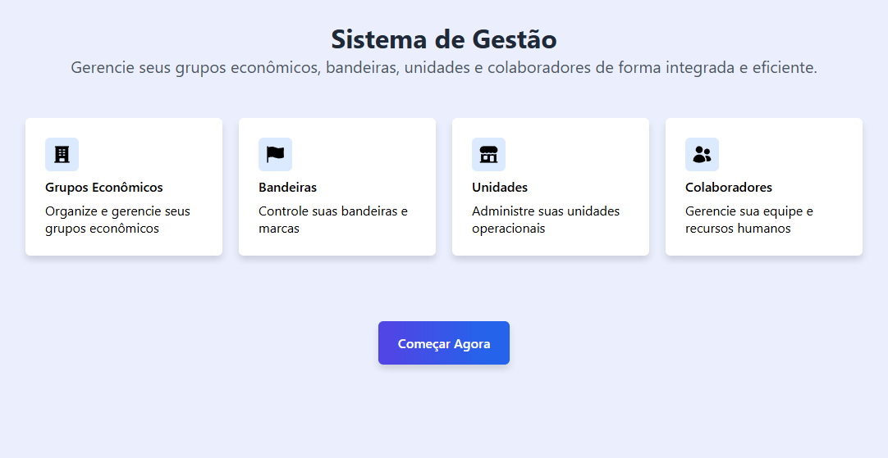
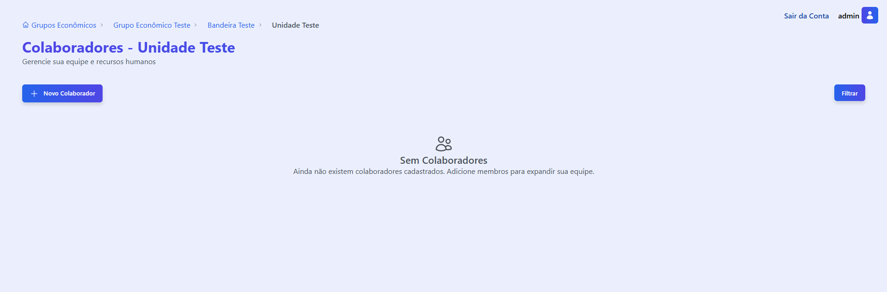

# Projeto Laravel: Sistema de Gerenciamento

## Descrição

Este projeto Laravel é um sistema de gerenciamento desenvolvido para organizar e controlar informações relacionadas a grupos, bandeiras, unidades e colaboradores, além de funcionalidades de auditoria e exportação de dados. Sendo o meu primeiro projeto Laravel, ele inclui roteamento, autenticação, componentes Livewire para interatividade e funcionalidades como exportação de dados para Excel.

## Funcionalidades

- **Autenticação de Usuários**: Sistema de login e logout para acesso seguro.
- **Gerenciamento de Grupos**: Criar, atualizar, visualizar e deletar grupos econômicos.
- **Gerenciamento de Bandeiras**: Criar, atualizar, visualizar e deletar bandeiras associadas a um grupo econômico.
- **Gerenciamento de Unidades**: Criar, atualizar, visualizar e deletar unidades associadas a uma bandeira.
- **Gerenciamento de Colaboradores**: Criar, atualizar, visualizar e deletar colaboradores associados a uma unidade.
- **Auditorias**: Funcionalidade para registrar e visualizar eventos de auditoria.
- **Exportação de Dados**: Exportação de dados em formato Excel (`.xlsx`) utilizando o pacote Maatwebsite/Excel.
- **Interface Interativa**: Utilização do Livewire para componentes dinâmicos e reativos no frontend.

## Tecnologias Utilizadas

Este projeto foi desenvolvido utilizando as seguintes tecnologias e pacotes:

- **PHP**: Linguagem de programação principal (versão ^8.2).
- **Laravel**: Framework PHP para desenvolvimento web (versão ^12.0).
- **Livewire**: Framework full-stack para Laravel que permite construir interfaces dinâmicas usando PHP puro (versão ^3.6).
- **Blade UI Kit / Blade Heroicons**: Coleção de componentes Blade e ícones Heroicons para uma interface de usuário consistente e moderna (versão ^2.6).
- **Maatwebsite/Excel**: Pacote para exportação de dados para planilhas Excel (versão ^3.1).

## Instalação e Configuração

Para configurar e executar este projeto em seu ambiente local, siga os passos abaixo:

1. **Clone o repositório:**
   ```bash
   git clone https://github.com/emnuelht/sistema-gestao.git
   cd sistema-gestao
   ```

2. **Instale as dependências do Composer:**
   ```bash
   composer install
   ```

3. **Crie o arquivo de ambiente:**
   ```bash
   cp .env.example .env
   ```

4. **Gere a chave da aplicação:**
   ```bash
   php artisan key:generate
   ```

5. **Execute as migrações do banco de dados:**
   ```bash
   php artisan migrate
   ```

6. **Instale as dependências do Node.js e compile os assets:**
   ```bash
   npm install
   npm run dev
   ```
   Ou para produção:
   ```bash
   npm run build
   ```

7. **Inicie o servidor de desenvolvimento Laravel:**
   ```bash
   php artisan serve
   ```

   O projeto estará acessível em `http://127.0.0.1:8000` (ou a porta que for exibida no terminal).

## Uso

Após a instalação e configuração, você pode acessar o sistema através do navegador. As rotas principais incluem:

- `/login`: Página de login.
- `/home` ou `/`: Home principal.
- `/grupos`: Gerenciamento de grupos.
- `/auditorias`: Visualização de auditorias.
- `/export-data`: Rota para exportar dados (acessível via link no sistema).

As rotas de gerenciamento de Bandeiras, Unidades e Colaboradores são dinâmicas e acessadas através da navegação pelo sistema, seguindo a hierarquia: `Grupos -> Bandeira -> Unidade -> Colaborador`.


1. **Login**

Para começarmos, precisamos logar!

Em usuário vamos digitar: **admin**, e para a senha: **123**


2. **Home**

Na página inicial, temos algumas informações sobre o sistema. Logo em seguida temos o botão para acessar o sistema.




3. **Grupos Econômicos**

Estando na tela de grupos econômicos, podemos verificar alguns botões de navegação no canto superior à direita, como "Sair da conta", "Auditorias", "Exportar Planilha", e o nosso login "Admin". Percebemos que quando vazio o sistema informa que não contém grupos no momento, com isso podemos adicionar um grupo clicando no botão "Novo Grupo Econômico".


3.1 **Adicionando um Grupo Econômico**

Quando clicamos em "Novo Grupo Econômico", aparece na tela um "Popup" para adicionar um Grupo Econômico, nesse exemplo irei criar um, chamando-o de "Grupo Econômico Teste".


3.2 **Lista de Grupos criados**

Depois de criado o grupo, vimos que ele vai aparecer logo abaixo, informando o nome do grupo com um ícone de edifício, temos também a quantidade de bandeiras criadas nele, e a data de criação/atualização.


3.3 **Item da lista**

O item da lista que estamos vendo, ele tem alguns segredinhos, que são opções ocultas que são só visualizadas quando o cursor do mouse é passado por cima do item, observe o exemplo abaixo:

Sem o cursor no item


Com o cursor no item


Vimos que aparecem duas opções, uma de editar e outra de deletar o item, a opção de editar, serve tanto para visualizar as informações como atualizar aquele item, e para acessar o nosso grupo, podemos clicar no item que iremos ser direcionados para a tela de "Bandeiras" dentro do nosso grupo.

Como funciona o editar e o deletar?

Para editar o item, basta clicar no ícone de editar, que irá aparecer um popup com as informações deste item, podendo eu atualizar ou só visualizar e fechar aquele popup, mostrarei no exemplo abaixo:


Para deletar, basta clicar no ícone de lixeira que irá aparecer um popup com um alerta se deseja deletar ou não, mostrarei no exemplo abaixo:


Se você tiver certeza que deseja deletar este item, basta clicar em "Deletar", caso contrário clique em "Fechar".


4. **Bandeiras**

Em bandeiras, dentro do grupo econômico chamado "Grupo Econômico Teste", podemos verificar que na navegação no canto superior à direita, temos somente "Sair da conta" e o nosso login "Admin", temos também outro tipo de navegação que informa ao usuário onde ele está, logo acima do título temos informando de onde viemos e onde estamos: "Grupos Econômicos > Grupo Econômico Teste". Percebemos que quando vazio o sistema informa que não contém bandeiras, igual em grupos econômicos, com isso podemos adicionar uma bandeira clicando no botão "Nova Bandeira".


4.1 **Adicionando uma Bandeira**

Quando clicamos em "Nova Bandeira", aparece na tela um "Popup" para adicionar uma Bandeira, irei criar uma bandeira chamando-a de "Bandeira Teste".


4.2 **Lista de Bandeiras**

Depois de criada uma bandeira, vimos que ela vai aparecer logo abaixo, informando o nome da bandeira com um ícone de uma bandeira, temos também a quantidade de unidades criadas nela, e a data de criação/atualização.


4.3 **Item da lista**

O item da lista segue o mesmo raciocínio do grupo econômico, tanto para editar, visualizar ou deletar.


5. **Unidades**

Em unidades, dentro da bandeira chamada "Bandeira Teste", a nossa informação da navegação que informa ao usuário onde ele está, mudou, agora estamos em: "Grupos Econômicos > Grupo Econômico Teste > Bandeira Teste". Percebemos que quando vazio o sistema informa que não contém unidades, igual às outras telas anteriores, com isso podemos adicionar uma unidade clicando no botão "Nova Unidade".


5.1 **Adicionando uma Unidade**

Quando clicamos em "Nova Unidade", aparece na tela um "Popup" para adicionar uma Unidade, irei criar uma unidade com o nome fantasia "Unidade Teste", a razão social eu coloquei "Unidade Operacional Norte LTDA" e para o CNPJ eu acessei o gerador de CNPJ válido para o teste.


5.2 **Lista de Unidades**

Depois de criada uma unidade, vimos que ela vai aparecer logo abaixo, informando o nome da unidade com um ícone de uma loja, temos também a quantidade de colaboradores criados nela, e a data de criação/atualização.


5.3 **Item da lista**

O item da lista segue o mesmo raciocínio das telas anteriores, tanto para editar, visualizar ou deletar.


6. **Colaboradores**

Em colaboradores, dentro da unidade chamada "Unidade Teste", a nossa informação da navegação que informa ao usuário onde ele está, mudou, agora estamos em: "Grupos Econômicos > Grupo Econômico Teste > Bandeira Teste > Unidade Teste". Percebemos que quando vazio o sistema informa que não contém colaboradores, igual às outras telas anteriores, com isso podemos adicionar um colaborador clicando no botão "Novo Colaborador".




6.1 **Adicionando um Colaborador**

Quando clicamos em "Novo Colaborador", aparece na tela um "Popup" para adicionar um Colaborador, irei criar um com o meu nome "Emanuel", o email eu coloquei "emanuel.com@gmail.com" e para o CPF eu acessei o gerador de CPF válido para o teste.


6.2 **Lista de Colaboradores**

Depois de criado um colaborador, vimos que ele vai aparecer logo abaixo na tabela, informando o nome do colaborador, email, CPF e a data de criação/atualização.


6.3 **Item da Tabela**

O item da tabela é mais visível o que podemos fazer, para editar/visualizar temos o botão na linha do colaborador, e ao lado temos o botão de deletar, irá aparecer o popup com as informações do usuário em editar e o popup de deletar, alertando o usuário para ver se realmente ele deseja deletar aquele colaborador.


6.4 **Filtrar**

Na nossa tela de colaboradores temos algo diferencial das demais que é o filtro, onde podemos filtrar o colaborador pelo nome, email, CPF e atualizado em, tem também a opção de restaurar para limpar os filtros.


7. **Auditorias**

Em auditorias, mas antes para acessar esta tela, precisamos voltar à tela de "Grupos Econômicos", e no canto superior direito clicamos em "Auditorias". Agora que estamos em Auditorias, vamos começar: durante o projeto eu tive que testar o sistema, e nesses testes, as ações que realizei foram registradas e estão listadas na tabela a seguir:


Nela informa a tabela que foi modificada, o ID registrado, a ação que o usuário fez, quem fez "Modificado Por" e a data de modificado "Modificado Em", temos também o botão para ver as modificações feitas por esse usuário.


7.1 **Mudanças**

Clicando em "Ver Mudanças", irá aparecer um popup com as mudanças feitas pelo usuário, nesse caso "admin", irei utilizar o nosso colaborador "Emanuel" que criei para mostrar os estados das mudanças como: criado, editado e deletado, segue os exemplos abaixo:

**Criação (created):**

Criei o colaborador Emanuel


**Edição (updated):**

Editei o colaborador Emanuel (nome, email)


Editei o colaborador Emanuel (CPF)


**Remoção (deleted):**

Deletei o colaborador Emanuel


 8. **Exportação da Planilha**

Para exportar a planilha, basta clicar no botão de "Exportar Planilha", que ele vai baixar a planilha no formato `.xlsx`.


## Licença

Este projeto está licenciado sob a licença MIT. Veja o arquivo LICENSE para mais detalhes.
